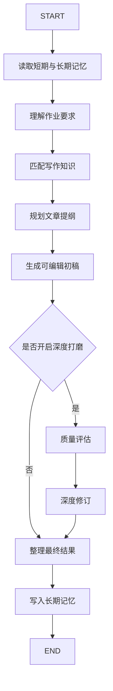

# DeepPen LangGraph Agent

一个参考 `qy-write` 架构重写的学生课程大作业版写作智能体。项目保留了原项目的前后端分离、FastAPI 路由层、LangGraph Builder/Node 分层、工作流注册表、流式事件输出和记忆服务设计，但业务从“公文写作”改成“学生写作训练”。

默认模型通过 OpenAI 兼容接口接入，示例模型名为 `qwen3.6-flash-2026-04-16`。只要服务商提供兼容的 `base_url`、`api_key` 和 `model`，即可替换为其他大模型。

## 功能

- 作业起草：根据题目、要求、材料、评分关注点生成课程作业初稿。
- 文章润色：保留原意，优化结构、逻辑和学生化表达。
- 深度打磨：用户主动开启后，额外执行质量评估和深度修订；默认关闭以提升生成速度。
- 短期记忆：LangGraph `InMemorySaver` 以 `session_id` 作为 `thread_id` 保存单会话图状态。
- 长期记忆：SQLite 持久化保存学生偏好、评分规则、历史产出和会话记录。
- 会话管理：支持历史会话列表、关键词搜索、查看对话详情、软删除和恢复会话。
- 本地知识检索：默认使用 SQLite + TurboVec/NumPy 本地向量检索，可选择知识库、上传文件、检索预览，并把片段注入 LangGraph 写作节点。
- AI 生成题材：左侧按钮可调用模型自动生成课程写作题目、要求、材料和评分关注点。
- 流程可视化：前端展示 LangGraph 节点轨迹，适合课堂演示和答辩。

## 架构

```text
backend/
  app/
    api/routers/          # FastAPI 路由
    core/                 # 配置和 LLM 工厂
    graph/
      builders/           # LangGraph 构建器
      nodes/              # Agent 节点
      edges/              # 条件路由
      registry.py         # 工作流注册表
      states.py           # 图状态定义
    memory/               # SQLite 长期记忆
    models/               # Pydantic 请求模型
    services/             # 写作知识规则、本地 TurboVec 检索、RAGFlow 可选代理
    ragflow_seed/         # 写作知识库种子文档
    utils/                # SSE 和工作流工具
frontend/
  src/
    components/           # Vue 组件
    services/api.ts       # SSE 和记忆 API
```

## LangGraph 工作流



## 启动

后端：

```bash
cd backend
pip install -r requirements.txt
python run.py
```

前端：

```bash
cd frontend
npm install
npm run dev
```

默认地址：

- 前端：http://localhost:5173
- 后端：http://localhost:8030/docs

## 模型配置

复制 `backend/.env.example` 为 `backend/.env`，填入自己的 OpenAI 兼容模型 API Key、Base URL 和模型名：

```env
LLM_PROVIDER=bailian
BAILIAN_API_KEY=your_compatible_api_key
BAILIAN_BASE_URL=https://dashscope.aliyuncs.com/compatible-mode/v1
MODEL_NAME=qwen3.6-flash-2026-04-16
ALLOW_LOCAL_FALLBACK=true
```

不要把真实 Key 提交给老师或公开仓库。提交作业时可以保留 `.env.example`，删除 `.env`。前端左侧模型状态会显示最近一次是 `LLM 已调用` 还是 `本地回退`。

## 本地 TurboVec 知识库

项目默认使用本地知识库，不需要外部知识库 API Key。上传资料后，后端会把文本切片写入 SQLite，并使用 TurboVec 量化向量索引检索；如果当前环境没有安装 `turbovec` Python 扩展，会自动降级为 NumPy 相似度检索，演示不会中断。

```env
KNOWLEDGE_BACKEND=local_turbovec
TURBOVEC_DIM=512
TURBOVEC_BIT_WIDTH=4
TURBOVEC_DEFAULT_TOP_K=6
```

初始化示例写作知识库：

```bash
cd backend
python scripts/init_ragflow_writing_kb.py
```

也可以在页面“知识库与记忆”区域点击“初始化写作库”。

如果要使用你给的 `/Users/simples/memory/turbovec_副本` 作为真正 TurboVec 引擎，需要先把其中的 `turbovec-python` 编译安装到后端 Python 环境；未安装时系统会显示 `numpy-fallback`，但功能仍可用。

```bash
pip install maturin
cd /Users/simples/memory/turbovec_副本/turbovec-python
maturin develop --release
```

如需切回 RAGFlow Cloud，可把 `KNOWLEDGE_BACKEND=ragflow`，再配置：

```env
RAGFLOW_BASE_URL=https://cloud.ragflow.io
RAGFLOW_API_KEY=your_ragflow_api_key
RAGFLOW_DEFAULT_TOP_K=6
```

## 会话和记忆管理

右侧“会话与长记忆”面板包含两个视图：

- 会话：查看历史对话列表，按题目、会话 ID 或对话内容搜索，打开会话详情，软删除或恢复会话。
- 长期记忆：查看学生画像、偏好、规则、经验，也可以手动写入新的长期记忆。

软删除不会物理删除数据库记录，只给会话写入 `deleted_at`，默认列表和统计会隐藏已删除会话。

## 验证

```bash
cd backend
python scripts/verify_workflow.py
python scripts/ping_bailian.py
python scripts/init_ragflow_writing_kb.py
```

`verify_workflow.py` 不调用真实模型，只验证 LangGraph 链路。`ping_bailian.py` 会调用百炼云模型，用来确认 Key 和模型配置是否可用。`init_ragflow_writing_kb.py` 会按 `KNOWLEDGE_BACKEND` 初始化本地 TurboVec 或 RAGFlow 写作知识库。

如果 `ping_bailian.py` 返回 `AllocationQuota.FreeTierOnly`，说明百炼免费额度已用完且账号限制为只使用免费额度。可以在百炼控制台关闭“仅使用免费额度”模式、开通付费额度，或换一个仍有额度的模型/API Key。项目运行时默认 `ALLOW_LOCAL_FALLBACK=true`，额度不可用时不会导致课堂演示中断。
